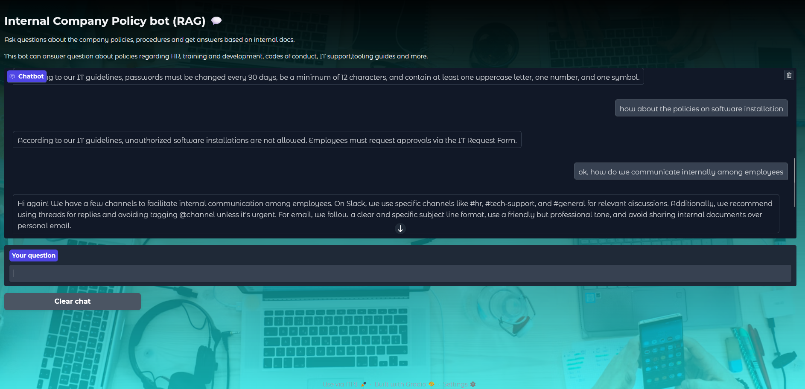

# Internal Company Policy Bot (RAG)

**Tech Stack and tools used**

## Project Overview

This project is an AI-powered chatbot designed to help employees quickly find answers to questions about internal company policies and procedures. It uses a Retrieval-Augmented Generation (RAG) architecture to provide accurate and context-aware responses based on a collection of company documents.

How it Works

1.  **Document Loading & Chunking:** Policy documents from the `documents/` folder are loaded using `TextLoader` and then split into smaller, manageable chunks using `RecursiveCharacterTextSplitter`.
2.  **Embedding & Indexing:** Each chunk is converted into a numerical vector (embedding). These embeddings are stored in a FAISS vector index. If the index doesn't exist in the `faiss_index/` directory, it's created and saved; otherwise, the existing index is loaded.
3.  **Querying & Retrieval:** When a user asks a question, it's embedded, and the FAISS index is queried to find the most relevant document chunks (`k=3` by default).
4.  **Augmented Prompting & Generation:** The retrieved chunks (context), the user's question, and recent chat history (last 5 turns) are formatted into a custom prompt. This augmented prompt is then sent to the Llama 3 model via Groq to generate a relevant answer.
5.  **Conversation Memory:** The `ConversationBufferWindowMemory` keeps track of the conversation, ensuring the LLM has context from recent interactions.

## Setup instructions

Clone the repo, create a virtual env and download dependencies using the requirements.txt. use an .env file to store your groq API key and run the app using `python app.py`. you can add more documents to the documents folder in either .txt or .md format. 

---
Built with ❤️ by [Subhanu](https://github.com/subhanu-dev)
